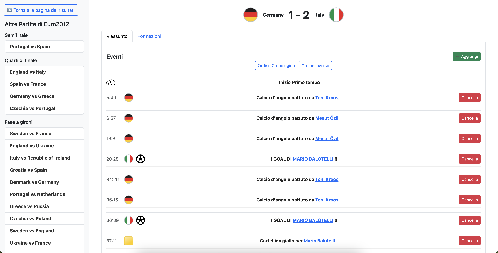

# Eurozone - Progetto per l'esame di Basi di Dati 2
## Sviluppato da Sorrentino Giuseppe Pio, Sorrentino Pasquale e Piegari Vito
**Eurozone** è un'applicazione web sviluppata in Python con Flask e MongoDB, progettata per gestire e visualizzare i dati storici delle partite di tutte le edizioni passate degli europei.

### Fasi iniziali
##### Scelta del dataset
Il dataset utilizzato è "Football / Soccer: UEFA Euro 1960-2024", disponibile su [Kaggle](https://www.kaggle.com/datasets/piterfm/football-soccer-uefa-euro-1960-2024).
##### Pre-processing dei dati
Le 4 tabelle presenti nel dataset sono state analizzate e sottoposte ad un processo di data-cleaning in cui sono state rimosse le colonne ridondanti o con una grande quantità di valori nulli.
##### Caricamento nel database MongoDB (NoSQL)
Le tabelle, una volta pulite, sono state successivamente caricate sul DBMS non relazionale MongoDB sotto forma di document. Per una questione di collaborazione tra i membri del progetto, il database è stato deployato sul cloud [MongoDB Atlas](https://www.mongodb.com/products/platform/atlas-database).

### Risultati
Il risultato del progetto è un'applicazione web in grado di permettere la gestione e la visualizzazione dei dati storici degli europei.

#### Architettura dell'applicazione
Eurozone è stata divisa in tre componenti principali:
- **Database**: contenente i dati e deployata su MongoDB Atlas, i dati sono stati caricati dopo essere stati puliti;
- **Backend**: contenente la business logic dell'applicazione, sviluppata in python. Per ogni document è stata creata una classe model per rappresentare l'oggetto in questione e una classe repository che consentisse l'accesso al dato reale nella collection sul cloud, oltre che ad effettuare operazioni CRUD su di esso. I dati vengono serviti attraverso l'utilizzo della libreria flask.
- **Frontend**: contenente la parte visiva dell'applicazione, sviluppata utilizzando bootstrap e resa dinamica utilizzando jinja (il template engine di  flask).

## Funzionalità
Le funzionalità prodotte sono state le seguenti:
### S01: Homepage

In questa pagina è presente un listato di tutte le edizioni dal 1964 al 2024 con allegato il loro logo

### S02: Risultati

In questa pagina sono presenti i risultati dell'edizione scelta dalla home page, sul drawer a sinistra è possibile muoversi attraverso le altre edizioni.
##### Query
Per il corretto funzionamento di questa pagina viene interrogata la collection _**match**_ e vengono selezionati tutti i match che hanno il campo _year_ uguale a quello selezionato, i dati vengono successivamente raggruppati per il campo _round_ ("FINAL", "SEMI-FINAL", etc)

### S03: Match

Il click sul match effettuato sulla schermata descritta in precedenza porta in questa pagina dove sono presenti le varie informazioni sul match scelto, come il risultato, la lista degli eventi e le formazioni.
##### Query
Per il corretto funzionamento di questa pagina viene interrogata la collection _**match**_ e viene scelto il match con il campo _id\_match_ uguale a quello scelto, per individuare i dati sulle formazioni, viene presa la lista della rosa dai campi _home\_lineups_ e _away\_lineups_ e per ognuno viene interrogata la collection _**player**_ e vengono presi i dati dettagliati del singolo giocatore.
L'aggiunta e la cancellazione di un evento vengono gestiti attraverso la classe _MatchRepository_ che si occupa di propagare i dati aggiornati al database.
 
### S04: Player

In questa schermata vengono mostrati i dettagli del calciatore selezionato e alcune statistiche come le edizioni a cui ha partecipato.
##### Query
Viene interrogata la collection _**player**_, mentre per le statistiche sulle edizioni partecipate dal giocatore viene interrogata la collection _**match**_ e si controlla se _id\_player_ è presente in almeno una _home\_lineups_ o _away\_lineups_.